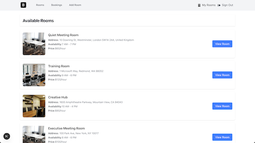
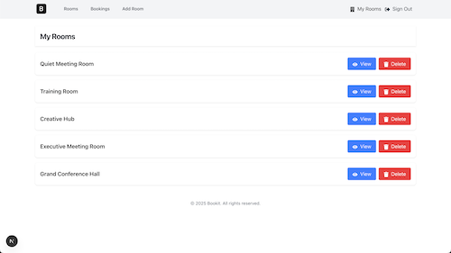
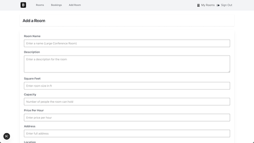

# 📚 BookIt

A modern, full-stack web application for discovering, booking, and managing your favorite workspace.

---

## 🚀 Live Demo

[](https://bookit-renx.vercel.app/)

---

## ✨ Features

- 📖 **Personal Library:** Save, organize, and manage your bookings.
- 🗓️ **Booking System:** Book rooms without double-bookings.
- 🛡️ **Authentication:** Secure sign-up, login, and user profiles.
- 📱 **Responsive Design:** Looks great on any device.

<p align="center">
  
  
  
</p>

---

## 🛠️ Tech Stack

| Layer         | Technology                                                                                            |
|---------------|-------------------------------------------------------------------------------------------------------|
| **Frontend**  | [Next.js](https://nextjs.org), [React](https://react.dev)                                             |
| **Styling**   | [Tailwind CSS](https://tailwindcss.com), [Inter Font](https://vercel.com/font)                        |
| **State**     | [React Context API](https://react.dev/reference/react/useContext)                                     |
| **Backend**   | [MongoDB](https://mongodb.com)          |                                                              |
| **Dev Tools** | [ESLint](https://eslint.org), [Prettier](https://prettier.io) |

---

## ⚡ Getting Started

1. **Clone the repository:**
   ```bash
   git clone https://github.com/agwebryanmuna/Bookit.git
   cd bookit
   ```

2. **Install dependencies:**
   ```bash
   npm install
   # or
   yarn install
   ```

3. **Run the development server:**
   ```bash
   npm run dev
   # or
   yarn dev
   ```

4. Open [http://localhost:3000](http://localhost:3000) in your browser.

---

## 🔑 Environment Variables

Create a `.env.local` file in the root directory and add the following (replace with your actual values):

```env
CLOUDINARY_API_KEY=
CLOUDINARY_API_SECRET=
CLOUDINARY_CLOUD_NAME=
CLOUDINARY_URL=
MONGODB_URI=
JWT_SECRET=
NEXT_PUBLIC_JWT_SECRET=
# Add any other required variables here
```

---

## 🤝 Contributing

Contributions are welcome! Please open an issue or submit a pull request for any improvements or suggestions.

---
